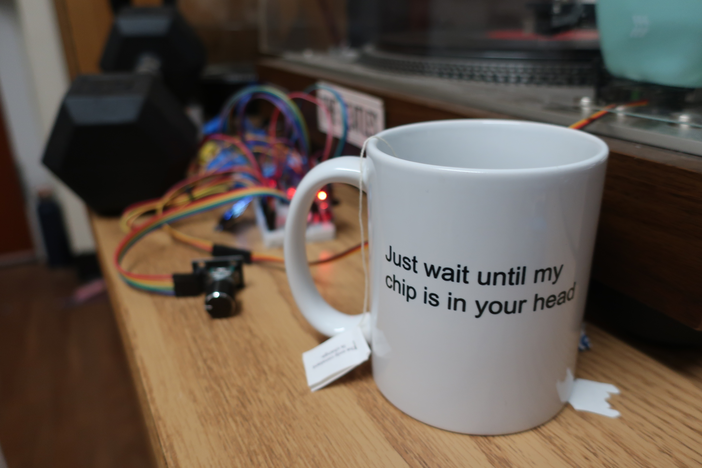

## Hi, I'm Alex

I am a Cognitive Science student at Columbia University who is focused on neural engineering, machine learning, and embedded systems.

- Interests: Brain Computer Interfaces, Epilespy, Neuro, Electrical Engineering
- Tools: Python, MATLAB, Javascript, C++, Arduino
- Projects: A lot of EEG signal processing, Computational Neuroscience, Embedded devices, as well as a suite of (in my opinion) cool personal apps. 

My website took me a while to make, please check it out: https://alexspeer.com  
Email: alexspeer12{at}gmail{dot}com

